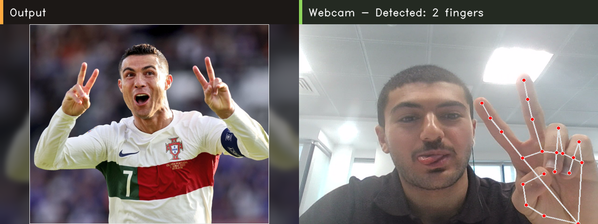

# Meme Hand Gesture Detector

A lightweight Python computer-vision project that uses your webcam to detect hand gestures and display a matching meme/image beside the camera feed.

This recreates the simple TikTok-style project where a hand sign controls which image appears on screen.

## Demo



## Tech stack

- Python
- OpenCV
- MediaPipe Hands
- NumPy

## Features

- Real-time webcam hand tracking
- Named gesture detection for bite, thumb, zero, one, two, three, four, and five
- Separate display windows for Output and Webcam
- Clean output image fitting that preserves each image's shape
- Smoothing to reduce flickering between gestures
- Screenshot capture with one keypress
- Replaceable image assets for custom memes

## Project structure

```text
meme-hand-detector/
├── app.py
├── requirements.txt
├── README.md
├── LICENSE
├── .gitignore
├── assets/
│   └── memes/
│       ├── bite.png
│       ├── thumb.png
│       ├── no_hand.png
│       ├── zero.png
│       ├── one.png
│       ├── two.png
│       ├── three.png
│       ├── four.png
│       └── five.png
└── screenshots/
```

## Setup

### 1. Clone the repo

```bash
git clone https://github.com/oaln04/meme-hand-detector.git
cd meme-hand-detector
```

### 2. Create a virtual environment

Windows:

```bash
python -m venv .venv
.venv\Scripts\activate
```

macOS/Linux:

```bash
python3 -m venv .venv
source .venv/bin/activate
```

### 3. Install dependencies

```bash
pip install -r requirements.txt
```

### 4. Run the app

```bash
python app.py
```

Controls:

```text
q or ESC  quit
s         save screenshot to screenshots/demo.png
```

## Customizing the meme images

Replace the files inside `assets/memes/` with your own images.

Supported names:

```text
no_hand.png
bite.png
thumb.png
zero.png
one.png
two.png
three.png
four.png
five.png
```

You can also use `.jpg`, `.jpeg`, or `.webp`.

## Optional run settings

Use a different webcam:

```bash
python app.py --camera 1
```

Change display size:

```bash
python app.py --width 720 --height 540
```

Increase/decrease gesture smoothing:

```bash
python app.py --history 12
```

## How it works

1. OpenCV reads frames from the webcam.
2. MediaPipe detects hand landmarks.
3. The app checks for special bite and thumb gestures first.
4. If neither special gesture is found, the raised-finger count becomes the gesture value.
5. The app displays the image mapped to that gesture.

## Portfolio notes

This project demonstrates:

- Real-time computer vision
- Webcam input handling
- Landmark-based gesture recognition
- Simple UI composition with OpenCV
- Clean Python project structure

## Next improvements

- Add more gesture details to the Output window
- Add sound effects per gesture
- Add a Streamlit web demo
- Save short demo clips automatically
- Use custom gestures instead of only finger count
